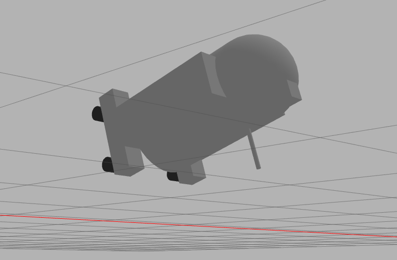

# ROS_project 
My project for IRos course in Innopolis University.
This is a simple project about creating r2d2 robot, which can be controlled by keyboard.



---

## Get started
To start this project you may have all installed packages, which is used here 
(see [Sources](#Sources))

Also, you may clone this repository to new [workspace](http://wiki.ros.org/catkin/Tutorials/create_a_workspace)

So for opening gazebo with robot and controller it's required to write in console

```commandline
roslaunch r2d2_movement start.launch
```

Then it opens gazebo and robot. Use the console to control the r2d2. The controller has the same keys as 
[twist_teleop](http://wiki.ros.org/teleop_twist_keyboard)

---

## Sources

- [ROS noetic](http://wiki.ros.org/noetic)
- [twist_teleop_keyboard package](http://wiki.ros.org/teleop_twist_keyboard)
- [Gazebo](https://gazebosim.org/home), [package for ROS](http://wiki.ros.org/gazebo_ros_pkgs)

---

## Additional
Thanks to [GPrathap](https://github.com/GPrathap) and [hany606](https://github.com/hany606) for education in this course.
It was very helpful and interesting to understand something new in robotics 😄
